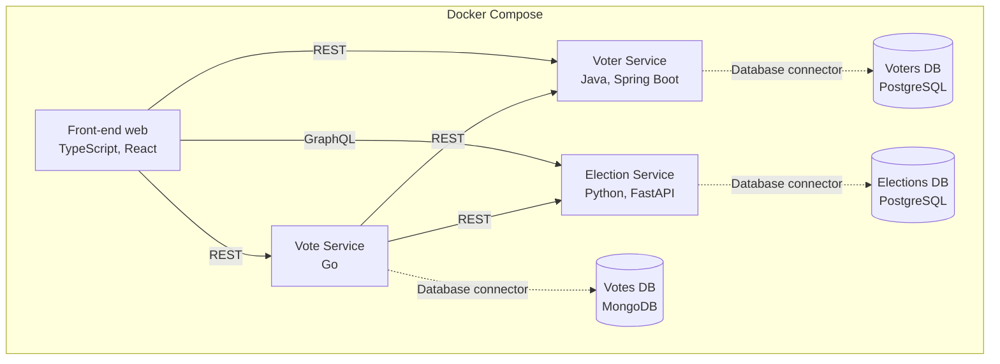
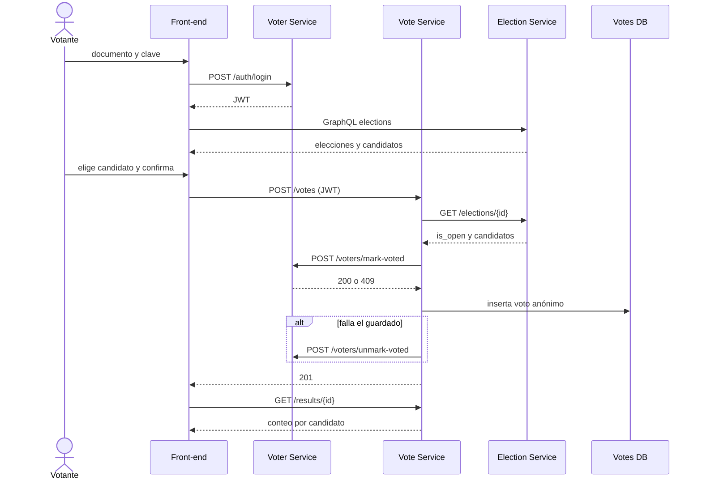

# Sistema de votación - Prototipo 1(Avance)

Guía del equipo para el primer prototipo de Arquitectura de Software (UNAL, 2026-II).
Aquí está lo que ya funciona, cómo funciona, y lo que falta con el detalle necesario para hacerlo.

- Fecha límite de entrega del artefacto: lunes 12 de octubre de 2026 (MiCampus, un solo integrante lo sube).
- Presentación en clase: martes 13 de octubre de 2026.

## Contenido

1. [Estado actual](#1-estado-actual)
2. [Arquitectura](#2-arquitectura)
3. [Cómo ejecutarlo](#3-cómo-ejecutarlo)
4. [Lo que ya funciona y cómo funciona](#4-lo-que-ya-funciona-y-cómo-funciona)
5. [Lo que falta y cómo hacerlo](#5-lo-que-falta-y-cómo-hacerlo)
6. [Contratos entre servicios](#6-contratos-entre-servicios)
7. [Flujo completo de un voto](#7-flujo-completo-de-un-voto)
8. [Cómo se cumplen los requisitos del enunciado](#8-cómo-se-cumplen-los-requisitos-del-enunciado)
9. [Reparto de trabajo, Git y calendario](#9-reparto-de-trabajo-git-y-calendario)
10. [Variables de entorno](#10-variables-de-entorno)
11. [Limitaciones conocidas](#11-limitaciones-conocidas)

---

## 1. Estado actual

| Componente | Lenguaje y herramientas | Estado | Responsable |
|---|---|---|---|
| Front-end web | TypeScript, React, Vite, nginx | Básico: lista elecciones | ______ |
| Election Service | Python, FastAPI, SQLAlchemy, Strawberry | Completo | David |
| Elections DB | PostgreSQL | Completa | David |
| Voter Service | Java, Spring Boot | Pendiente | ______ |
| Voters DB | PostgreSQL | Pendiente | ______ |
| Vote Service | Go, net/http, driver de MongoDB | Completo (falta integrarlo con el Voter Service) | Sebastián |
| Votes DB | MongoDB | Completa | Sebastián |

Lo que se puede hacer hoy: ver las elecciones con su estado y candidatos en el front-end, y administrarlas
(crear, editar, abrir, cerrar) desde Swagger, y consultar resultados en el Vote Service. Lo que todavía no
se puede: iniciar sesión y votar de punta a punta (el Vote Service ya está, pero necesita al Voter Service
para marcar al votante; mientras no exista, `POST /votes` responde `502`).


## 2. Arquitectura

Estilo: distribuido de tipo Service-Based (pocos servicios grandes, uno por dominio, cada uno con su propia
base de datos), con un front-end SOFEA (el navegador descarga la aplicación y luego consume los servicios).



Decisiones de diseño:

- Una base de datos por servicio, ninguna compartida. Cada servicio es dueño de sus datos y los demás
  solo los ven a través de su API.
- Identidad y voto separados. Quién votó vive en PostgreSQL (Voters DB) y qué se votó vive en MongoDB
  (Votes DB). El voto no guarda ningún dato del votante, así que el anonimato depende de esa separación.
- Dos tipos de conector HTTP: REST (entre servicios y para votar) y GraphQL (el front-end consulta
  elecciones con sus candidatos anidados). Los conectores a las bases de datos no son HTTP.
- Ningún servicio comparte código con otro. Se hablan solo por los contratos de la sección 6.

## 3. Cómo ejecutarlo

Requisitos: Docker Desktop abierto y con el motor corriendo, y Git.

```bash
git clone https://github.com/Cam152/ArquiSoft.git
cd ArquiSoft
docker compose up --build
```

| Qué | URL |
|---|---|
| Front-end | http://localhost:3000 |
| Election Service, Swagger (REST) | http://localhost:8000/docs |
| Election Service, GraphiQL (GraphQL) | http://localhost:8000/graphql |
| Election Service, health check | http://localhost:8000/health |
| Vote Service, health check | http://localhost:8002/health |
| Vote Service, resultados de la elección 1 | http://localhost:8002/results/1 |

Detener: `docker compose down`. Detener y borrar los datos: `docker compose down -v`
(útil para volver a cargar los datos de ejemplo).

Si sale `error during connect ... dockerDesktopLinuxEngine`, Docker Desktop está cerrado:
ábranlo y esperen a que diga "Engine running".

## 4. Lo que ya funciona y cómo funciona

### 4.1 Election Service (Python)

Gestiona elecciones y candidatos. Está en `election-service/`.

**Capas del código** (`app/`):

| Archivo | Responsabilidad |
|---|---|
| `main.py` | Crea la app FastAPI, CORS, manejadores de errores, `/health` y monta REST y GraphQL |
| `routers/elections.py` | Endpoints REST (solo traducen HTTP a llamadas de `services`) |
| `graphql_api.py` | Esquema GraphQL de solo lectura (Strawberry) |
| `services.py` | Reglas de negocio, compartidas por REST y GraphQL |
| `models.py` | Tablas SQLAlchemy: `elections` y `candidates` |
| `schemas.py` | Validación de entrada y forma de las respuestas (Pydantic) |
| `security.py` | Protección de escritura con `X-API-Key` |
| `database.py` | Motor de base de datos, sesión por petición, espera a PostgreSQL |
| `seed.py` | Carga las 3 elecciones de ejemplo |
| `config.py` | Lee la configuración de variables de entorno |

**Cómo arranca:** al iniciar espera a que PostgreSQL responda (reintenta hasta 30 veces), crea las tablas
si no existen y, si la base está vacía y `SEED_DATA=true`, carga los datos de ejemplo.

**Reglas de negocio:**

- Una elección tiene estado `draft` (borrador), `active` (abierta) o `closed` (cerrada).
- Solo en `draft` se puede editar, eliminar la elección, agregar o quitar candidatos.
- Para abrirla (`draft` a `active`) se necesitan al menos 2 candidatos.
- Solo una elección `active` se puede cerrar.
- `is_open` es verdadero si el estado es `active` y la fecha actual está dentro de `starts_at` y `ends_at` (si existen).
- Cada candidato recibe un número de tarjetón automático (1, 2, 3...). No se repite nombre dentro de una elección.

**Errores:** siempre JSON `{"detail": "mensaje"}`. `401` llave inválida, `404` no existe, `409` operación
no válida para el estado actual, `422` datos inválidos.

**REST** (lectura pública, escritura con header `X-API-Key`, valor por defecto `dev-admin-key`):

| Método y ruta | Descripción | Llave |
|---|---|---|
| `GET /elections?status=active` | Lista elecciones (filtro opcional) | No |
| `GET /elections/{id}` | Detalle con candidatos. Lo usará el Vote Service | No |
| `GET /elections/{id}/candidates/{cid}` | Un candidato | No |
| `POST /elections` | Crea una elección en borrador | Sí |
| `PATCH /elections/{id}` | Edita nombre, descripción o fechas (solo borrador) | Sí |
| `DELETE /elections/{id}` | Elimina (solo borrador) | Sí |
| `POST /elections/{id}/candidates` | Agrega un candidato (solo borrador) | Sí |
| `DELETE /elections/{id}/candidates/{cid}` | Quita un candidato (solo borrador) | Sí |
| `POST /elections/{id}/activate` | Abre la elección | Sí |
| `POST /elections/{id}/close` | Cierra la elección | Sí |

Respuesta típica de `GET /elections/1` (los campos REST van en `snake_case`):

```json
{
  "id": 1,
  "name": "Elección de representante estudiantil 2026",
  "status": "active",
  "is_open": true,
  "candidate_count": 3,
  "candidates": [
    {"id": 1, "election_id": 1, "number": 1, "name": "Ana Torres", "description": "..."}
  ]
}
```

**GraphQL** en `/graphql` (solo lectura, campos en `camelCase`). Lo usa el front-end porque permite pedir
la elección con sus candidatos en una sola consulta y solo los campos necesarios:

```graphql
{
  elections(status: "active") {
    id
    name
    isOpen
    candidates { number name }
  }
}
```

**Pruebas:** desde `election-service/`, `pip install -r requirements-dev.txt` y luego `pytest`.
Usan SQLite en memoria, no necesitan Docker.

### 4.2 Elections DB (PostgreSQL)

Dos tablas: `elections` (nombre, descripción, estado, fechas) y `candidates` (con llave foránea a
`elections`, borrado en cascada y número único por elección). Los datos persisten en el volumen
`elections-db-data`. El Election Service se conecta por SQLAlchemy y psycopg2 (conector de base de datos).

### 4.3 Front-end (TypeScript, React)

Está en `frontend/`.

- Al cargar, `src/api.ts` hace un `POST` a `/graphql` del Election Service y `src/App.tsx` pinta la lista
  con estado de carga, error con botón "Reintentar" y estado vacío.
- El botón "Votar" aparece desactivado en las elecciones abiertas. Es el punto de entrada para el flujo
  que falta (sección 5.3).
- Se compila con Vite y se sirve como archivos estáticos con nginx (`nginx.conf` redirige todo a `index.html`).
- La URL del Election Service se fija al compilar con `VITE_ELECTION_API_URL`. Es la URL que ve el
  navegador, por eso es `http://localhost:8000` y no el nombre del contenedor.
- El navegador llama directo al servicio, así que el Election Service permite ese origen con CORS
  (`CORS_ORIGINS`, por defecto `http://localhost:3000`).

### 4.4 Vote Service (Go)

Recibe el voto, lo valida con los otros dos servicios, guarda el voto anónimo y calcula resultados.
Está en `vote-service/` y escucha en el puerto 8002. Es el único dueño de la Votes DB.

**Archivos:**

| Archivo | Responsabilidad |
|---|---|
| `main.go` | Arranque: configuración, conexión a MongoDB, servidor HTTP y apagado ordenado |
| `handlers.go` | Rutas (`net/http`), `POST /votes`, `GET /results/{election_id}`, `/health` y el middleware de CORS |
| `clients.go` | Conector REST hacia el Election Service y el Voter Service (timeout de 5 segundos) |
| `store.go` | Conector a MongoDB: colecciones `votes` y `audit`, índice y agregación de resultados |
| `config.go` | Lee la configuración de variables de entorno |
| `handlers_test.go` | Pruebas con MongoDB y los otros servicios simulados |
| `Dockerfile` | Compila el binario en `golang:1.23-alpine` y lo ejecuta en `alpine:3.20` |

**Cómo arranca:** espera a que MongoDB responda (reintenta hasta 30 veces), crea el índice
`{election_id: 1, candidate_id: 1}` sobre `votes` y empieza a escuchar.

**Endpoints** (contrato completo en la sección 6.2):

| Método y ruta | Descripción |
|---|---|
| `GET /health` | `200 {"status": "ok"}` |
| `POST /votes` | Registra un voto. Requiere `Authorization: Bearer <jwt>` |
| `GET /results/{election_id}` | Conteo y porcentaje por candidato (público) |

**Orden de `POST /votes`** (el orden importa, ver sección 7):

1. Valida el cuerpo (`election_id` y `candidate_id` enteros) y que venga el header `Authorization`.
2. `GET {ELECTION_SERVICE_URL}/elections/{id}`: si no existe, 404; si `is_open` es falso, 409; si el candidato
   no está en `candidates`, 422. Se hace antes de marcar para no dejar votantes marcados por una elección cerrada.
3. `POST {VOTER_SERVICE_URL}/voters/mark-voted` reenviando el `Authorization` del cliente y agregando
   `X-Service-Key`. Si responde 401 o 409, se devuelve lo mismo al cliente.
4. Inserta el voto en `votes`, con `candidate_name` tomado de la respuesta del paso 2.
5. Si el paso 4 falla, llama a `POST /voters/unmark-voted` (compensación) y responde 500.
6. Registra el evento en `audit`. Si falla, solo queda en el log; no se deshace el voto.
7. Responde `201 {"status": "recorded"}`.

Si el Election Service o el Voter Service no responden, devuelve `502`.

**Resultados:** una agregación `$group` por `candidate_id` cuenta los votos. Luego se completa con la lista
de candidatos de `GET /elections/{id}` para que aparezcan los que tienen 0 votos, se calcula el porcentaje
(2 decimales) y se ordena de más a menos votos.

**Cómo ejecutarlo:**

```bash
# Con todo el sistema (desde la raíz del repositorio)
docker compose up --build

# Solo el Vote Service y lo que necesita (votes-db, election-service y elections-db)
docker compose up --build vote-service

# Ver sus logs
docker compose logs -f vote-service
```

**Cómo probarlo:**

```bash
curl http://localhost:8002/health
curl http://localhost:8002/results/1

# Votar (el token sale de POST /auth/login del Voter Service)
curl -i -X POST http://localhost:8002/votes \
  -H "Authorization: Bearer <jwt>" \
  -H "Content-Type: application/json" \
  -d '{"election_id": 1, "candidate_id": 2}'

# Ver los votos guardados (no llevan datos del votante)
docker compose exec votes-db mongosh votes --eval "db.votes.find()"
```

Mientras el Voter Service no exista, `POST /votes` valida la elección y el candidato (404, 409, 422) y
al llegar al paso 3 responde `502 {"detail": "El Voter Service no responde"}`.

**Pruebas:** no hace falta instalar Go, se corren en un contenedor. Desde `vote-service/`:

```bash
docker run --rm -v "$PWD":/src -w /src golang:1.23-alpine go test ./...
```

Con Go 1.23 o superior instalado basta `go test ./...`. Las pruebas simulan MongoDB, el Election Service
y el Voter Service, así que no necesitan el compose. Si cambian dependencias, corran `go mod tidy` (igual,
en el contenedor) y suban `go.mod` y `go.sum`.

### 4.5 Votes DB (MongoDB)

Base `votes` con dos colecciones. Los datos persisten en el volumen `votes-db-data`. No se publica ningún
puerto: solo el Vote Service la ve, por la red de Compose.

- `votes`: `{election_id, candidate_id, candidate_name, cast_at}`. No lleva nada del votante. `cast_at` se
  redondea a la hora para que no se pueda cruzar con el momento exacto en que alguien fue marcado.
- `audit`: eventos `{type: "vote_registered", election_id, at}`. Tampoco lleva datos del votante, y `at` se
  redondea igual que `cast_at`.

### 4.6 Docker Compose

`docker-compose.yml` define hoy cinco contenedores: `elections-db`, `election-service`, `votes-db`,
`vote-service` y `frontend`.

- `depends_on` con `condition: service_healthy`: el servicio espera a que su base de datos esté sana
  y el front-end espera al Election Service.
- Cada servicio tiene `healthcheck` (PostgreSQL con `pg_isready`, MongoDB con `mongosh`, el Election Service
  y el Vote Service consultando `/health`).
- Dentro de la red de Compose los contenedores se llaman por el nombre del servicio y el puerto interno
  (por ejemplo `http://election-service:8000`). Desde el navegador se usa `localhost` y el puerto publicado.
  Es la confusión más común: servicio a servicio usa el nombre del contenedor, el front-end usa `localhost`.

## 5. Lo que falta y cómo hacerlo

Orden recomendado: primero los esqueletos con `/health` y el compose (5.1), luego cada servicio en
paralelo (5.2 y 5.3) y al final el front-end (5.4) y la integración.

### 5.1 Esqueleto y compose (todos, primero)

Cada servicio nuevo debe empezar con: carpeta propia, `Dockerfile`, endpoint `GET /health` que responda
`200 {"status": "ok"}`, y su entrada en `docker-compose.yml`. Con eso `docker compose up --build` ya levanta
los 7 contenedores (hoy levanta 5) y cada quien trabaja sin bloquear a los demás.

Bloques que faltan por pegar en `docker-compose.yml` (dentro de `services:`):

```yaml
  voters-db:
    image: postgres:16-alpine
    environment:
      POSTGRES_USER: ${VOTERS_DB_USER:-voters}
      POSTGRES_PASSWORD: ${VOTERS_DB_PASSWORD:-voters}
      POSTGRES_DB: ${VOTERS_DB_NAME:-voters}
    volumes:
      - voters-db-data:/var/lib/postgresql/data
    healthcheck:
      test: ["CMD-SHELL", "pg_isready -U $${POSTGRES_USER} -d $${POSTGRES_DB}"]
      interval: 5s
      timeout: 3s
      retries: 10
    restart: unless-stopped

  voter-service:
    build: ./voter-service
    environment:
      DB_URL: jdbc:postgresql://voters-db:5432/${VOTERS_DB_NAME:-voters}
      DB_USER: ${VOTERS_DB_USER:-voters}
      DB_PASSWORD: ${VOTERS_DB_PASSWORD:-voters}
      JWT_SECRET: ${JWT_SECRET:-dev-jwt-secret-change-me-0123456789abcdef}
      SERVICE_API_KEY: ${SERVICE_API_KEY:-dev-service-key}
      CORS_ORIGINS: ${CORS_ORIGINS:-http://localhost:3000}
    ports:
      - "8001:8001"
    depends_on:
      voters-db:
        condition: service_healthy
    healthcheck:
      test: ["CMD", "wget", "-qO-", "http://localhost:8001/health"]
      interval: 10s
      timeout: 5s
      retries: 6
      start_period: 30s
    restart: unless-stopped
```

Y al final del archivo, en `volumes:`, agregar `voters-db-data:`.

`votes-db` y `vote-service` ya están en el compose. Cuando exista el `voter-service`, agregarlo al
`depends_on` del `vote-service` (con `condition: service_healthy`), donde hoy hay un `TODO`.

El servicio `frontend` también debe esperar a los nuevos servicios y recibir sus URLs (ver 5.4).
Las imágenes `eclipse-temurin:21-jre-alpine` y `alpine` traen `wget`, que usan los healthchecks.

### 5.2 Voter Service (Java, Spring Boot) - puerto 8001

**Qué hace:** autentica votantes y lleva el control de quién ya votó. Es el único dueño de la Voters DB.

**Dependencias sugeridas (Maven):** `spring-boot-starter-web`, `spring-boot-starter-data-jpa`,
`spring-boot-starter-validation`, `postgresql`, `spring-security-crypto` (solo para BCrypt) y `jjwt` (JWT).

**Datos:** una tabla `voters` con `id`, `document` (único), `name`, `password_hash` y `has_voted`
(booleano, por defecto `false`). No guarden la hora en que votó: un dato así permitiría cruzarlo con el
voto y romper el anonimato.

**Datos de ejemplo:** al arrancar, si la tabla está vacía, insertar 5 votantes de demostración con
documentos `1000000001` a `1000000005` y clave `voter123`, guardando la clave con BCrypt
(con un `CommandLineRunner`, no con un SQL que tenga el hash pegado).

**Endpoints** (detalle en la sección 6.1): `POST /auth/login`, `POST /voters/mark-voted`,
`POST /voters/unmark-voted` y `GET /health`.

**Cómo implementar lo importante:**

- Login: buscar por `document`, comparar con `BCryptPasswordEncoder.matches`, y firmar un JWT HS256 con
  `JWT_SECRET`, con `sub` = id del votante y expiración de 1 hora.
- Marcar como votado debe ser atómico. Eso es lo que impide votar dos veces aunque lleguen dos peticiones
  a la vez. Con JPA:

  ```java
  @Modifying
  @Query("update Voter v set v.hasVoted = true where v.id = :id and v.hasVoted = false")
  int markVoted(@Param("id") Long id);   // 1 = marcado, 0 = ya había votado
  ```

  Si devuelve `0`, responder `409`.
- `unmark-voted` es la compensación (sección 7): hace lo contrario y debe ser idempotente.
- `mark-voted` y `unmark-voted` exigen además el header `X-Service-Key` igual a `SERVICE_API_KEY`.
  Sin eso, un votante podría llamar a `unmark-voted` con su propio token y votar de nuevo.
- CORS: permitir el origen `CORS_ORIGINS` y los headers `Authorization` y `Content-Type`
  (el front-end hace una petición previa `OPTIONS` por el header `Authorization`).

**Dockerfile sugerido:**

```dockerfile
FROM maven:3.9-eclipse-temurin-21 AS build
WORKDIR /app
COPY pom.xml .
RUN mvn -q dependency:go-offline
COPY src ./src
RUN mvn -q package -DskipTests

FROM eclipse-temurin:21-jre-alpine
WORKDIR /app
COPY --from=build /app/target/*.jar app.jar
EXPOSE 8001
ENTRYPOINT ["java", "-jar", "app.jar"]
```

En `application.properties`: `server.port=8001`, y leer `DB_URL`, `DB_USER`, `DB_PASSWORD`, `JWT_SECRET`,
`SERVICE_API_KEY` y `CORS_ORIGINS` de variables de entorno. Usar `spring.jpa.hibernate.ddl-auto=update`
para que cree la tabla.

**Listo cuando:** login devuelve un JWT, `mark-voted` responde 200 la primera vez y 409 la segunda, y
`unmark-voted` lo deja votar de nuevo.

### 5.3 Vote Service (Go) - puerto 8002

Implementado, ver la sección 4.4. Falta la integración con el Voter Service: agregarlo a su `depends_on`
en el compose y repetir la prueba con un token real.

**Listo cuando:** un voto válido responde 201 y aparece en MongoDB sin datos del votante; el mismo votante
recibe 409 al repetir; una elección cerrada responde 409; y `GET /results/1` devuelve el conteo.

### 5.4 Front-end (TypeScript, React)

Hay que completar el flujo en `frontend/src`. Pantallas sugeridas:

1. **Login:** documento y clave, llama a `POST /auth/login` del Voter Service. Guardar el token en
   memoria (o `sessionStorage`) y enviarlo como `Authorization: Bearer <token>`.
2. **Lista de elecciones:** ya existe. Mostrar "Votar" solo si `isOpen` y hay sesión.
3. **Votar:** elegir un candidato, confirmar y llamar a `POST /votes` del Vote Service. Mostrar mensajes
   claros según el código: 201 "Voto registrado", 409 "Ya votaste" o "La elección no está abierta", 401
   "Tu sesión expiró, vuelve a ingresar".
4. **Resultados:** `GET /results/{id}` del Vote Service, con barras o porcentajes por candidato.

Cambios técnicos:

- Agregar en `src/api.ts` las funciones `login`, `castVote` y `fetchResults` (la URL de cada servicio sale de
  una variable de entorno de Vite, igual que `VITE_ELECTION_API_URL`).
- Agregar `VITE_VOTER_API_URL` (`http://localhost:8001`) y `VITE_VOTE_API_URL` (`http://localhost:8002`) como
  `ARG` y `ENV` en `frontend/Dockerfile`, y como `args` del servicio `frontend` en el compose.
- Quitar del `App.tsx` el aviso del pie de página cuando el flujo esté completo.

Ejemplo de las llamadas nuevas:

```ts
export async function login(document: string, password: string): Promise<string> {
  const res = await fetch(`${VOTER_API_URL}/auth/login`, {
    method: "POST",
    headers: { "Content-Type": "application/json" },
    body: JSON.stringify({ document, password }),
  });
  if (!res.ok) throw new Error((await res.json()).detail);
  return (await res.json()).access_token;
}

export async function castVote(token: string, electionId: number, candidateId: number) {
  const res = await fetch(`${VOTE_API_URL}/votes`, {
    method: "POST",
    headers: { "Content-Type": "application/json", Authorization: `Bearer ${token}` },
    body: JSON.stringify({ election_id: electionId, candidate_id: candidateId }),
  });
  if (!res.ok) throw new Error((await res.json()).detail);
}
```

**Listo cuando:** se puede entrar con un votante de ejemplo, votar en la elección abierta, no se puede votar dos
veces y los resultados cambian.

## 6. Contratos entre servicios

Convenciones comunes a todos los servicios:

- JSON en `snake_case` en REST. Errores siempre como `{"detail": "mensaje"}`.
- Todos exponen `GET /health` que responde `200 {"status": "ok"}`.
- Configuración solo por variables de entorno; logs a la salida estándar.
- El token del votante viaja en `Authorization: Bearer <jwt>`. Las llamadas internas que solo debe hacer otro
  servicio llevan además `X-Service-Key: <SERVICE_API_KEY>`.

### 6.1 Voter Service (puerto 8001)

`POST /auth/login`

```json
// Petición
{"document": "1000000001", "password": "voter123"}
// 200
{"access_token": "<jwt>", "token_type": "Bearer", "expires_in": 3600}
// 401
{"detail": "Documento o clave incorrectos"}
```

`POST /voters/mark-voted` (headers `Authorization` y `X-Service-Key`, sin cuerpo)

| Código | Cuándo | Cuerpo |
|---|---|---|
| 200 | Se marcó al votante | `{"status": "marked"}` |
| 401 | Token inválido o expirado, o llave de servicio incorrecta | `{"detail": "..."}` |
| 409 | El votante ya había votado | `{"detail": "El votante ya votó"}` |

`POST /voters/unmark-voted` (mismos headers, sin cuerpo): revierte la marca. `200 {"status": "unmarked"}`,
idempotente.

### 6.2 Vote Service (puerto 8002)

`POST /votes` (header `Authorization`)

```json
// Petición
{"election_id": 1, "candidate_id": 2}
// 201
{"status": "recorded"}
```

| Código | Cuándo |
|---|---|
| 401 | Token inválido o expirado |
| 404 | La elección no existe |
| 409 | La elección no está abierta, o el votante ya votó |
| 422 | El candidato no pertenece a la elección, o el cuerpo es inválido |
| 502 | El Election Service o el Voter Service no responden |
| 500 | Falló el guardado del voto (ya se compensó) |

`GET /results/{election_id}` (público)

```json
{
  "election_id": 1,
  "total_votes": 10,
  "results": [
    {"candidate_id": 2, "candidate_name": "Luis Herrera", "votes": 6, "percentage": 60.0},
    {"candidate_id": 1, "candidate_name": "Ana Torres", "votes": 4, "percentage": 40.0},
    {"candidate_id": 3, "candidate_name": "Camila Duarte", "votes": 0, "percentage": 0.0}
  ]
}
```

404 si la elección no existe. Ordenado de más a menos votos.

### 6.3 Election Service (puerto 8000)

El Vote Service solo necesita `GET /elections/{id}` (ver 4.1): campos `is_open` y `candidates[].id`,
`candidates[].name`. El front-end usa GraphQL.

## 7. Flujo completo de un voto



Por qué este orden: primero se valida la elección (para no marcar votantes por una elección cerrada), luego
se marca al votante (atómico, impide el doble voto) y por último se guarda el voto. Como PostgreSQL y MongoDB no
comparten transacción, si el último paso falla se compensa desmarcando al votante.

## 8. Cómo se cumplen los requisitos del enunciado

| Requisito | Cómo se cumple |
|---|---|
| Arquitectura distribuida | 7 contenedores que se comunican por red |
| Al menos 1 componente de presentación (web) | Front-end React |
| Al menos 2 componentes de lógica | Election Service, Voter Service y Vote Service |
| Al menos 2 componentes de datos (relacional y NoSQL) | PostgreSQL (Elections DB y Voters DB) y MongoDB (Votes DB) |
| Al menos 2 tipos de conectores HTTP | REST y GraphQL |
| Al menos 3 lenguajes de propósito general | Python, Java y Go (más TypeScript en el front-end) |
| Despliegue orientado a contenedores | Docker y Docker Compose |

El entregable `p1_X.pdf` (creado en .md y exportado a PDF) debe tener: equipo (nombre y nombres completos),
sistema (nombre, logo y descripción), estructura de componentes y conectores (vista C&C, estilos
arquitectónicos usados, descripción de elementos y relaciones) y los comandos para descargar y ejecutar.
La vista C&C de la sección 2 y las descripciones de las secciones 4 a 6 son la base.

## 9. Reparto de trabajo, Git y calendario

**Reparto sugerido:** una persona por servicio y una para el front-end; quien más sepa de Docker mantiene el
compose. Completen la columna "Responsable" de la sección 1.

**Git:**

- Cada quien trabaja en una rama (`feature/voter-service`, `feature/vote-service`, `feature/frontend`) y
  solo toca su carpeta. Los cambios al `docker-compose.yml` se hacen en cambios pequeños y se avisa al grupo
  para evitar conflictos.
- Antes de subir, `docker compose up --build` debe levantar sin errores.
- No subir `.env`, `node_modules/`, `target/` ni binarios. Sí subir `package-lock.json` y `go.sum`.

**Calendario** (hoy es lunes 5 de octubre):

| Fecha | Meta |
|---|---|
| Lun 5 y mar 6 | Esqueletos con `/health` y compose con los 7 contenedores sanos |
| Mié 7 y jue 8 | Cada servicio implementa su contrato y se prueba por separado |
| Vie 9 | Front-end completo e integración de punta a punta |
| Sáb 10 | Documento .md: equipo, sistema, vista C&C, estilos, elementos y relaciones, comandos y logo |
| Dom 11 | Probar desde cero (`git clone` y `docker compose up --build` en una máquina limpia) y exportar `p1_X.pdf` |
| Lun 12 | Entrega en MiCampus (un solo integrante) |
| Mar 13 | Presentación en clase |

**Prueba de integración mínima** (con todo arriba): login, ver elecciones, votar, votar otra vez (debe dar
409), ver resultados. En Windows PowerShell, `curl` es un alias de otra cosa: usen `curl.exe`, Swagger o
Postman, o guarden el JSON en un archivo y envíenlo con `curl.exe -d "@cuerpo.json"`.

## 10. Variables de entorno

Se pueden cambiar copiando `.env.example` a `.env`. Todas tienen un valor por defecto en el compose.

| Variable | Servicio | Por defecto | Uso |
|---|---|---|---|
| `ELECTIONS_DB_USER`, `ELECTIONS_DB_PASSWORD`, `ELECTIONS_DB_NAME` | Elections DB y Election Service | `elections` | Credenciales de la base |
| `ADMIN_API_KEY` | Election Service | `dev-admin-key` | Llave para escribir (`X-API-Key`) |
| `CORS_ORIGINS` | Todos los servicios | `http://localhost:3000` | Orígenes permitidos (separados por coma) |
| `SEED_DATA` | Election Service | `true` | Cargar elecciones de ejemplo |
| `VOTERS_DB_USER`, `VOTERS_DB_PASSWORD`, `VOTERS_DB_NAME` | Voters DB y Voter Service | `voters` | Credenciales de la base |
| `JWT_SECRET` | Voter Service | `dev-jwt-secret-...` | Firma de los JWT (mínimo 32 caracteres) |
| `SERVICE_API_KEY` | Voter Service y Vote Service | `dev-service-key` | Llave para llamadas entre servicios |
| `ELECTION_SERVICE_URL`, `VOTER_SERVICE_URL` | Vote Service | `http://election-service:8000`, `http://voter-service:8001` | Dónde están los otros servicios |
| `MONGO_URI`, `MONGO_DB` | Vote Service | `mongodb://votes-db:27017`, `votes` | Conexión a MongoDB |
| `VITE_ELECTION_API_URL`, `VITE_VOTER_API_URL`, `VITE_VOTE_API_URL` | Front-end (al compilar) | `http://localhost:8000`, `:8001`, `:8002` | URLs de los servicios vistas desde el navegador |

## 11. Limitaciones conocidas

Son decisiones de prototipo; conviene mencionarlas como trabajo futuro en la presentación.

- Sin HTTPS, sin límite de intentos de login y con claves de ejemplo por defecto (cámbienlas fuera de las pruebas).
- La consistencia entre PostgreSQL y MongoDB se resuelve con una compensación, no con una transacción
  distribuida. Si el servicio cae justo entre el marcado y el guardado, un votante podría quedar marcado sin voto.
- El anonimato depende de la separación de bases de datos y de redondear la hora del voto. Alguien con acceso
  a ambas bases y a los registros de red podría intentar cruzar datos.
- La administración de elecciones se hace por Swagger con una llave compartida; no hay pantalla de administración.
- No hay migraciones de base de datos: las tablas se crean al arrancar.

## Estructura del repositorio

```
.
├── docker-compose.yml
├── .env.example
├── election-service/    (Python, FastAPI)       completo
│   ├── Dockerfile
│   ├── app/
│   └── tests/
├── frontend/            (TypeScript, React)     básico
│   ├── Dockerfile
│   └── src/
├── vote-service/        (Go)                    completo
│   ├── Dockerfile
│   ├── go.mod, go.sum
│   └── *.go
└── voter-service/       (Java, Spring Boot)     pendiente
```