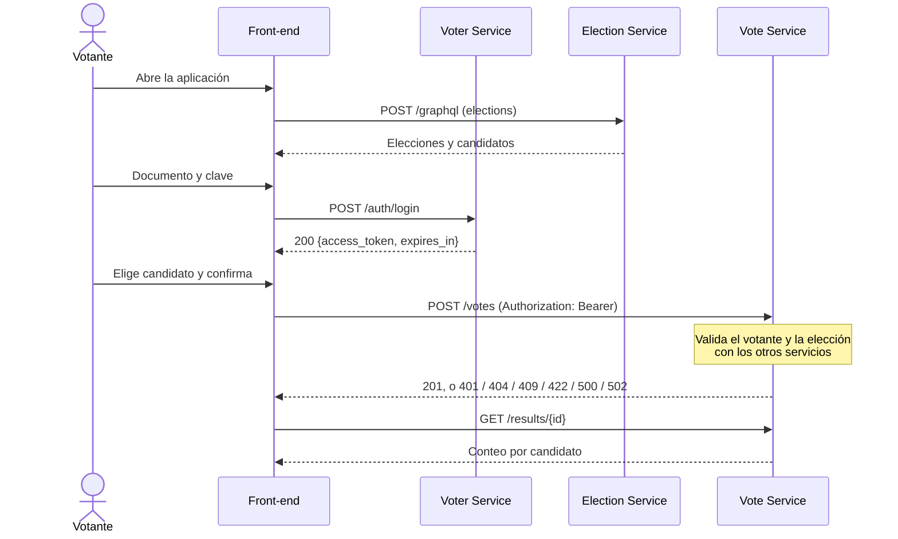

````markdown
# Front-end web: Sistema de votación

Aplicación web del votante para el Sistema de votación (Prototipo 1, Arquitectura de Software, UNAL 2026-II).
Está hecha con React 18, TypeScript y Vite, y en el despliegue se sirve como archivos estáticos con nginx.

## Contenido

1. [Visión general y propósito](#1-visión-general-y-propósito)
2. [Arquitectura y estructura del proyecto](#2-arquitectura-y-estructura-del-proyecto)
3. [Páginas y flujos de usuario](#3-páginas-y-flujos-de-usuario)
4. [Integración con los microservicios](#4-integración-con-los-microservicios)
5. [Variables de entorno y configuración](#5-variables-de-entorno-y-configuración)
6. [Despliegue y ejecución](#6-despliegue-y-ejecución)
7. [Consideraciones de diseño y decisiones técnicas](#7-consideraciones-de-diseño-y-decisiones-técnicas)

---

## 1. Visión general y propósito

Este front-end es el componente de presentación del sistema. Con él, el votante puede:

- consultar las elecciones registradas, con su estado y sus candidatos;
- iniciar sesión con su número de documento y su clave;
- emitir un único voto en una elección abierta;
- consultar los resultados de una elección, que son públicos.

Sigue el estilo SOFEA: el navegador descarga la aplicación una sola vez y después consume directamente
los tres servicios de lógica del sistema. No hay un backend propio del front-end ni un API gateway.

| Servicio | Tecnología | Conector | Uso desde el front-end |
|---|---|---|---|
| Election Service | Python, FastAPI | GraphQL | Elecciones y candidatos (solo lectura) |
| Voter Service | Java, Spring Boot | REST, puerto 8001 | Inicio de sesión (emite el JWT) |
| Vote Service | Go | REST, puerto 8002 | Emitir el voto y consultar resultados |

El front-end no guarda datos propios. La única información que conserva es la sesión del votante:
el token, el documento y la fecha de expiración.

## 2. Arquitectura y estructura del proyecto

```
frontend/
├── Dockerfile            compilación con Node 20 y servidor nginx
├── nginx.conf            redirige cualquier ruta a index.html
├── index.html
├── package.json
├── tsconfig.json
├── vite.config.ts
└── src/
    ├── main.tsx          punto de entrada de React
    ├── App.tsx           definición de rutas
    ├── styles.css        estilos globales (CSS plano con variables)
    ├── vite-env.d.ts     tipos de las variables VITE_*
    ├── services/
    │   └── api.ts        clientes de los tres servicios y ApiError
    ├── context/
    │   └── AuthContext.tsx
    ├── hooks/
    │   └── useAsync.ts
    ├── components/
    │   ├── Layout.tsx
    │   ├── RequireAuth.tsx
    │   ├── Notice.tsx
    │   └── StatusBadge.tsx
    └── pages/
        ├── ElectionsPage.tsx
        ├── LoginPage.tsx
        ├── VotePage.tsx
        └── ResultsPage.tsx
```

Las dependencias van en un solo sentido: `pages` usa `hooks`, `context` y `components`, y todos ellos
usan `services`. `services/api.ts` no importa nada de React, así que se puede probar o reutilizar
sin la interfaz.

### Módulos principales

| Módulo | Responsabilidad |
|---|---|
| `services/api.ts` | Único punto de contacto con la red. Define los tipos de los contratos (`Election`, `LoginResponse`, `ElectionResults`, etc.), las funciones `fetchElections`, `fetchElection`, `login`, `castVote` y `fetchResults`, y la clase `ApiError`, que convierte cada respuesta fallida en un error con código y mensaje listo para mostrar. |
| `context/AuthContext.tsx` | Guarda la sesión (`token`, `document`, `expiresAt`) y expone `login` y `logout` mediante el hook `useAuth()`. Persiste la sesión en `sessionStorage` y la cierra automáticamente cuando el token expira. |
| `hooks/useAsync.ts` | Ejecuta una petición cuando el componente se monta y devuelve su estado (`loading`, `success` o `error`) junto con una función `reload`. Descarta las respuestas que llegan después de que el componente se desmonta. Todas las pantallas lo usan para cargar datos. |
| `components/RequireAuth.tsx` | Protege las rutas privadas. Si no hay sesión, redirige a `/ingresar` y guarda la ruta de origen para volver después del login. |
| `components/Layout.tsx` | Encabezado común con el documento del votante y el botón "Salir". Renderiza la página activa con `<Outlet />`. |
| `components/Notice.tsx` | Avisos de información, éxito, advertencia y error con roles ARIA (`status` y `alert`). |
| `components/StatusBadge.tsx` | Etiqueta del estado de una elección: En preparación, Abierta o Cerrada. |

## 3. Páginas y flujos de usuario

| Ruta | Página | Acceso |
|---|---|---|
| `/` | `ElectionsPage` | Pública |
| `/ingresar` | `LoginPage` | Pública |
| `/elecciones/:id/votar` | `VotePage` | Requiere sesión |
| `/elecciones/:id/resultados` | `ResultsPage` | Pública |

Cualquier otra ruta redirige a `/`.

### 3.1 Inicio: lista de elecciones (`/`)

Consulta todas las elecciones con sus candidatos al Election Service por GraphQL. Muestra los estados
de carga, de error (con botón "Reintentar") y de lista vacía. Los botones de cada elección dependen de
su estado y de si hay sesión:

| Condición | Botón |
|---|---|
| Elección abierta y con sesión | **Votar**: lleva a `/elecciones/:id/votar` |
| Elección abierta y sin sesión | **Ingresa para votar**: lleva al login y después vuelve a la página de voto |
| Elección abierta o cerrada (no borrador) | **Ver resultados** |

### 3.2 Autenticación (`/ingresar`)

Formulario con número de documento y clave. Al enviarlo llama a `POST /auth/login` del Voter Service.
Si la respuesta es exitosa, guarda el JWT en el contexto de autenticación y redirige a la ruta de origen
(o a `/` si no la hay). Mientras la petición está en curso, el formulario queda deshabilitado.

Si el votante llega aquí porque su sesión expiró mientras votaba, la página lo indica con un aviso.
Si ya hay una sesión activa, la página redirige sin mostrar el formulario.

### 3.3 Votar (`/elecciones/:id/votar`, protegida)

El voto se emite en tres pasos para evitar errores, porque no se puede deshacer:

1. **Elegir:** lista de candidatos como botones de opción (radio). "Continuar" se habilita cuando hay
   un candidato seleccionado.
2. **Confirmar:** muestra el candidato elegido y advierte que el voto no se puede cambiar. Desde aquí
   se puede volver atrás con "Cambiar".
3. **Enviar:** llama a `POST /votes` con el token en el encabezado `Authorization: Bearer <token>`.

Qué pasa según la respuesta:

| Respuesta | Comportamiento |
|---|---|
| 201 | Confirma que el voto quedó registrado y ofrece ver resultados. |
| 401 | Cierra la sesión y lleva a `/ingresar` con el aviso de sesión expirada. Después del login, el votante vuelve a esta misma página. |
| 409, 404, 422 | Rechazo definitivo: oculta el formulario, muestra el motivo y ofrece ver resultados o volver a la lista. |
| 500, 502, 503 o sin conexión | Error transitorio: conserva la selección y muestra "Intentar de nuevo". |

Si la elección no está abierta cuando se carga la página, no se muestra el formulario.

### 3.4 Resultados (`/elecciones/:id/resultados`, pública)

Consulta `GET /results/{id}` del Vote Service y, en paralelo, los datos de la elección en el Election
Service para mostrar su nombre y estado. Los datos de la elección son opcionales: si el Election
Service no responde, el conteo se muestra igual.

- Muestra el total de votos y, por cada candidato, sus votos, su porcentaje y una barra proporcional.
- Resalta al candidato o candidatos con más votos (si hay empate, todos se marcan).
- Si la elección sigue abierta, advierte que los resultados son parciales.
- El botón "Actualizar" vuelve a consultar el conteo. No hay actualización automática.

### 3.5 Flujo completo de un voto



## 4. Integración con los microservicios

Toda la comunicación con los servicios está en `src/services/api.ts`. Las pantallas nunca llaman a
`fetch` directamente. Los contratos completos están en la sección 6 del README principal del repositorio.

### 4.1 Election Service (GraphQL)

| Función | Petición | Respuesta |
|---|---|---|
| `fetchElections()` | `POST {VITE_ELECTION_API_URL}/graphql` con la consulta `elections` | `Election[]` con candidatos anidados |
| `fetchElection(id)` | Reutiliza `fetchElections()` y filtra por `id` | `Election`, o `ApiError` 404 si no existe |

Campos consultados: `id`, `name`, `description`, `status`, `startsAt`, `endsAt`, `isOpen`,
`candidateCount` y `candidates { id number name description }`.

GraphQL puede responder HTTP 200 con un arreglo `errors` en el cuerpo. En ese caso, el primer error
se convierte en un `ApiError`.

### 4.2 Voter Service (REST, puerto 8001)

| Función | Petición | Respuesta exitosa |
|---|---|---|
| `login(document, password)` | `POST /auth/login` con `{"document", "password"}` | `200 {"access_token", "token_type", "expires_in"}` |

### 4.3 Vote Service (REST, puerto 8002)

| Función | Petición | Respuesta exitosa |
|---|---|---|
| `castVote(token, electionId, candidateId)` | `POST /votes` con `{"election_id", "candidate_id"}` y `Authorization: Bearer <token>` | `201` |
| `fetchResults(electionId)` | `GET /results/{election_id}` (sin autenticación) | `200 {"election_id", "total_votes", "results": [...]}` |

Los campos REST se mantienen en `snake_case`, igual que en los contratos, para no tener que traducirlos.

### 4.4 Manejo de errores: `ApiError`

Cada llamada fallida lanza un `ApiError` con tres campos:

| Campo | Contenido |
|---|---|
| `status` | Código HTTP de la respuesta, o `0` si no hubo respuesta (servicio caído, red o CORS) |
| `message` | Mensaje en español, listo para mostrar al votante |
| `detail` | Texto original del campo `detail` del cuerpo de error, o `null` |

Para construir el mensaje, la función interna `request` busca primero un mensaje definido para ese
código en la llamada concreta, después un mensaje genérico (502 y 503), después el `detail` del servidor
y, al final, un texto con el código HTTP. Todos los servicios responden los errores con la forma
`{"detail": "..."}`, y el cuerpo se lee una sola vez.

| Código | Origen | Mensaje mostrado | Reacción de la interfaz |
|---|---|---|---|
| 0 | Cualquiera | No se pudo conectar con el servidor | Permite reintentar |
| 401 | `login` | Documento o clave incorrectos | Mantiene el formulario |
| 401 | `castVote` | Tu sesión expiró, vuelve a ingresar | Cierra la sesión y redirige al login |
| 404 | `castVote`, `fetchResults` | La elección no existe | Sin reintento |
| 409 | `castVote` | Ya votaste, o La elección no está abierta (ver 7.3) | Rechazo definitivo |
| 422 | `login` | Revisa el documento y la clave | Mantiene el formulario |
| 422 | `castVote` | El candidato no pertenece a esta elección | Rechazo definitivo |
| 500 | `castVote` | No se pudo guardar tu voto y no quedó registrado | Permite reintentar |
| 502 | `castVote` | El sistema no puede validar tu voto en este momento | Permite reintentar |
| 502, 503 | Cualquiera | Un servicio no responde o no está disponible | Permite reintentar |

En `VotePage` un error se considera transitorio si `status` es `0` o mayor o igual a `500`. Cualquier
otro código es un rechazo definitivo. Reintentar después de un 500 es seguro, porque el Vote Service
desmarca al votante cuando no logra guardar el voto.

## 5. Variables de entorno y configuración

| Variable | Valor por defecto | Servicio |
|---|---|---|
| `VITE_ELECTION_API_URL` | `http://localhost:8000` | Election Service |
| `VITE_VOTER_API_URL` | `http://localhost:8001` | Voter Service |
| `VITE_VOTE_API_URL` | `http://localhost:8002` | Vote Service |

Hay que tener en cuenta dos cosas sobre estas variables:

- **Se fijan al compilar, no al ejecutar.** Vite reemplaza `import.meta.env.VITE_*` por su valor en el
  momento de `npm run build`. Si se cambia una URL después de compilar, no tiene efecto: hay que volver
  a compilar o reconstruir la imagen.
- **Son las URLs que ve el navegador.** Por eso apuntan a `localhost` y al puerto publicado, y no al
  nombre del contenedor (`http://vote-service:8002` no existe para el navegador).

Si una variable no está definida, se usa el valor por defecto que aparece en `api.ts`. Sus tipos están
declarados en `src/vite-env.d.ts`.

### 5.1 En local

Para cambiar los valores, se crea un archivo `frontend/.env.local` (Git lo ignora):

```bash
VITE_ELECTION_API_URL=http://localhost:8000
VITE_VOTER_API_URL=http://localhost:8001
VITE_VOTE_API_URL=http://localhost:8002
```

### 5.2 En Docker

El `Dockerfile` recibe las URLs como `ARG`, las convierte en `ENV` y compila con ellas:

```dockerfile
ARG VITE_ELECTION_API_URL=http://localhost:8000
ARG VITE_VOTER_API_URL=http://localhost:8001
ARG VITE_VOTE_API_URL=http://localhost:8002
ENV VITE_ELECTION_API_URL=$VITE_ELECTION_API_URL
ENV VITE_VOTER_API_URL=$VITE_VOTER_API_URL
ENV VITE_VOTE_API_URL=$VITE_VOTE_API_URL
RUN npm run build
```

En `docker-compose.yml` se pasan como `build.args`. Así se pueden sobrescribir desde el `.env` de la
raíz del repositorio:

```yaml
  frontend:
    build:
      context: ./frontend
      args:
        VITE_ELECTION_API_URL: ${VITE_ELECTION_API_URL:-http://localhost:8000}
        VITE_VOTER_API_URL: ${VITE_VOTER_API_URL:-http://localhost:8001}
        VITE_VOTE_API_URL: ${VITE_VOTE_API_URL:-http://localhost:8002}
    ports:
      - "3000:80"
    depends_on:
      election-service: { condition: service_healthy }
      voter-service: { condition: service_healthy }
      vote-service: { condition: service_healthy }
```

### 5.3 CORS

El navegador llama a los servicios desde otro origen, así que cada servicio debe aceptar el origen del
front-end en su variable `CORS_ORIGINS`. El valor por defecto es `http://localhost:3000`, que corresponde
al contenedor. En desarrollo con `npm run dev` el origen cambia a `http://localhost:5173`. Ver la
sección 6.1 para las dos formas de resolverlo.

## 6. Despliegue y ejecución

### 6.1 Ejecución local (desarrollo)

Requisitos: Node.js 20 o superior y npm. Los servicios deben estar corriendo, normalmente con
`docker compose up` desde la raíz del repositorio.

```bash
cd frontend
npm install
npm run dev
```

La aplicación queda en `http://localhost:5173`, con recarga en caliente.

Como los servicios solo aceptan por defecto el origen `http://localhost:3000`, hay dos opciones:

- Agregar `http://localhost:5173` a `CORS_ORIGINS` en el `.env` de la raíz y reiniciar los servicios.
- Detener el contenedor del front-end (`docker compose stop frontend`) y levantar Vite en el puerto 3000:
  `npm run dev -- --port 3000`.

Verificación de tipos y compilación:

```bash
npx tsc --noEmit     # solo verificación de tipos
npm run build        # tsc --noEmit + vite build, genera dist/
npm run preview      # sirve dist/ en local para revisarla
```

`npm run build` ya incluye la verificación de tipos, así que falla si hay errores de TypeScript.

### 6.2 Ejecución con Docker Compose

Desde la raíz del repositorio:

```bash
docker compose up --build
```

El front-end queda en `http://localhost:3000` cuando los tres servicios reportan buena salud
(`depends_on` con `condition: service_healthy`).

Para reconstruir solo el front-end después de un cambio:

```bash
docker compose up --build frontend
```

La imagen se construye en dos etapas. En la primera, `node:20-alpine` instala dependencias y compila.
En la segunda, `nginx:1.27-alpine` sirve solo la carpeta `dist/`. `nginx.conf` responde `index.html`
para cualquier ruta (`try_files $uri /index.html`), así que las rutas del cliente, como
`/elecciones/2/resultados`, funcionan al recargar la página o al abrirlas desde un enlace.

## 7. Consideraciones de diseño y decisiones técnicas

### 7.1 Enrutamiento con `react-router-dom` v6

Es la única dependencia agregada a React. Se incluyó porque los resultados de una elección deben tener
una URL propia que se pueda compartir y abrir directamente, y porque el flujo de login necesita volver a
la página de origen. Hacerlo a mano con el historial del navegador habría sido más código y más propenso
a errores. La configuración de nginx ya existente soporta este enrutamiento sin cambios.

Las rutas privadas se protegen con el componente `RequireAuth`, no dentro de cada página. La ruta de
origen viaja en `location.state` (`LoginRedirectState`) para regresar al votante a donde estaba.

### 7.2 Sesión y JWT

- **Dónde se guarda:** en `sessionStorage`, bajo la clave `votacion.session`. La sesión sobrevive a una
  recarga de la página y se borra al cerrar la pestaña. Así se reduce el riesgo en equipos compartidos,
  como un puesto de votación, frente a `localStorage`, que persiste indefinidamente. La clave del votante
  nunca se guarda.
- **Expiración automática:** al iniciar sesión se calcula `expiresAt` a partir de `expires_in` (una hora,
  según el contrato). Un temporizador cierra la sesión en ese momento, y al cargar la página se descartan
  las sesiones ya vencidas. Así el votante no ve una sesión aparentemente activa con un token inválido.
- **Si el servidor rechaza el token:** un 401 en `POST /votes` también cierra la sesión, aunque el
  temporizador no se haya cumplido (por ejemplo, si cambió `JWT_SECRET`).
- **Si el almacenamiento está bloqueado:** la sesión funciona solo en memoria. Todas las lecturas y
  escrituras están protegidas con `try/catch`.

### 7.3 Distinción del error 409

`POST /votes` responde 409 por dos causas distintas: el votante ya votó o la elección no está abierta.
Para el votante son situaciones diferentes y el mensaje debe reflejarlo.

`castVote` revisa el `detail` de la respuesta. Si contiene "ya vot" (sin importar mayúsculas), muestra
"Ya votaste. Cada votante puede votar una sola vez."; en cualquier otro caso, "La elección no está
abierta.". Esto depende de un acuerdo con el Vote Service: cuando el Voter Service responde 409 en
`mark-voted`, el Vote Service debe reenviar el mismo `{"detail": "El votante ya votó"}` sin modificarlo.
Si ese texto cambia, el front-end mostrará el mensaje de elección cerrada aunque la causa real sea un
voto duplicado.

### 7.4 Otras decisiones

- **Sin librerías de estado ni de peticiones.** El estado global se reduce a la sesión, así que basta con
  un contexto de React. La carga de datos se resuelve con `useAsync`.
- **Sin librerías de componentes.** Los estilos son CSS plano con variables en `:root` (`styles.css`),
  con foco visible, roles ARIA en los avisos y respeto a `prefers-reduced-motion`.
- **`fetchElection` reutiliza la consulta de la lista** en lugar de pedir un campo GraphQL por `id`.
  Así el front-end depende de una sola consulta del esquema. El costo es menor porque hay pocas elecciones.
- **Resultados tolerantes a fallos:** la página de resultados depende solo del Vote Service. Si el
  Election Service falla, se pierden el nombre y el estado, pero no el conteo.

### 7.5 Limitaciones del prototipo

- El token se guarda en `sessionStorage`, al que puede acceder JavaScript. Con una cookie `HttpOnly`
  el token quedaría protegido frente a XSS, pero los servicios tendrían que emitirla. Queda como mejora
  para un prototipo posterior.
- Los resultados no se actualizan solos. Hay que usar el botón "Actualizar".
- `has_voted` es un solo valor por votante en la Voters DB. Por eso, quien vota en una elección recibe
  409 en cualquier otra. Ver la sección 11 del README principal.
````