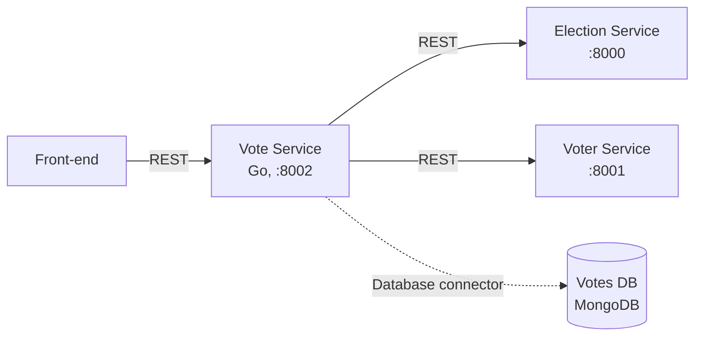

# Vote Service (Go)

Recibe el voto, lo valida con el Election Service y el Voter Service, guarda el voto anónimo en MongoDB
y calcula los resultados. Es el único dueño de la Votes DB. Escucha en el puerto 8002.

Hace parte del [sistema de votación](../README.md); los contratos con los otros servicios están en la
sección 6 de ese documento.



## Cómo ejecutarlo

Requisitos: Docker con el motor corriendo. No hace falta instalar Go.

Desde la raíz del repositorio:

```bash
# Todo el sistema
docker compose up --build

# Solo el Vote Service y lo que necesita (votes-db, election-service y elections-db)
docker compose up --build vote-service

# Logs
docker compose logs -f vote-service
```

Queda disponible en http://localhost:8002. Detener: `docker compose down`. Detener y borrar los votos
guardados: `docker compose down -v`.

El compose levanta dos contenedores para este componente: `vote-service` (este código) y `votes-db`
(imagen `mongo:7`, sin puerto publicado, con los datos en el volumen `votes-db-data`).

## Endpoints

| Método y ruta | Descripción |
|---|---|
| `GET /health` | `200 {"status": "ok"}` |
| `POST /votes` | Registra un voto. Requiere `Authorization: Bearer <jwt>` |
| `GET /results/{election_id}` | Conteo y porcentaje por candidato (público) |

Los errores siempre son JSON `{"detail": "mensaje"}`.

### `POST /votes`

```json
// Petición
{"election_id": 1, "candidate_id": 2}
// 201
{"status": "recorded"}
```

| Código | Cuándo |
|---|---|
| 401 | Falta el header `Authorization`, o el token es inválido o expiró |
| 404 | La elección no existe |
| 409 | La elección no está abierta, o el votante ya votó |
| 422 | El candidato no pertenece a la elección, o el cuerpo es inválido |
| 502 | El Election Service o el Voter Service no responden |
| 500 | Falló el guardado del voto (ya se compensó) |

Pasos, en este orden:

1. Valida el cuerpo y que venga el header `Authorization`.
2. `GET {ELECTION_SERVICE_URL}/elections/{id}`: revisa que exista, que `is_open` sea verdadero y que el
   candidato esté en `candidates`. Se hace antes de marcar para no dejar votantes marcados por una
   elección cerrada.
3. `POST {VOTER_SERVICE_URL}/voters/mark-voted`, reenviando el `Authorization` del cliente y agregando
   `X-Service-Key`. Si responde 401 o 409, se devuelve lo mismo al cliente.
4. Inserta el voto en `votes`.
5. Si el paso 4 falla, llama a `POST /voters/unmark-voted` (compensación) y responde 500.
6. Registra el evento en `audit`. Si falla, solo queda en el log; no se deshace el voto.
7. Responde 201.

### `GET /results/{election_id}`

```json
{
  "election_id": 1,
  "total_votes": 3,
  "results": [
    {"candidate_id": 2, "candidate_name": "Luis Herrera", "votes": 2, "percentage": 66.67},
    {"candidate_id": 1, "candidate_name": "Ana Torres", "votes": 1, "percentage": 33.33},
    {"candidate_id": 3, "candidate_name": "Camila Duarte", "votes": 0, "percentage": 0}
  ]
}
```

Ordenado de más a menos votos; incluye a los candidatos con 0 votos. 404 si la elección no existe.

## Cómo probarlo

```bash
curl http://localhost:8002/health
curl http://localhost:8002/results/1

# Votar (el token sale de POST /auth/login del Voter Service)
curl -i -X POST http://localhost:8002/votes \
  -H "Authorization: Bearer <jwt>" \
  -H "Content-Type: application/json" \
  -d '{"election_id": 1, "candidate_id": 2}'

# Ver los votos guardados (no llevan datos del votante)
docker compose exec votes-db mongosh votes --eval "db.votes.find()"
```

El token se obtiene con `POST http://localhost:8001/auth/login` y el cuerpo
`{"document": "1000000001", "password": "voter123"}` (hay cinco votantes de prueba, del `1000000001` al
`1000000005`). Si el Voter Service no está arriba, `POST /votes` responde
`502 {"detail": "El Voter Service no responde"}`.

En Windows PowerShell usen `curl.exe` en lugar de `curl`.

## Pruebas

Desde esta carpeta (`vote-service/`), en un contenedor:

```bash
docker run --rm -v "$PWD":/src -w /src golang:1.23-alpine go test ./...
```

Con Go 1.23 o superior instalado basta `go test ./...`. Las pruebas simulan MongoDB, el Election Service
y el Voter Service, así que no necesitan el compose.

## Variables de entorno

Todas tienen valor por defecto; el compose ya las define.

| Variable | Por defecto | Uso |
|---|---|---|
| `PORT` | `8002` | Puerto en el que escucha |
| `MONGO_URI` | `mongodb://votes-db:27017` | Conexión a MongoDB |
| `MONGO_DB` | `votes` | Nombre de la base |
| `ELECTION_SERVICE_URL` | `http://election-service:8000` | Dónde está el Election Service |
| `VOTER_SERVICE_URL` | `http://voter-service:8001` | Dónde está el Voter Service |
| `SERVICE_API_KEY` | `dev-service-key` | Llave que se envía en `X-Service-Key` al Voter Service |
| `CORS_ORIGINS` | `http://localhost:3000` | Orígenes permitidos (separados por coma) |

## Datos (MongoDB)

Base `votes`, dos colecciones. Ninguna guarda datos del votante.

- `votes`: `{election_id, candidate_id, candidate_name, cast_at}`, con índice sobre
  `{election_id: 1, candidate_id: 1}`. `cast_at` se redondea a la hora para que no se pueda cruzar con el
  momento exacto en que el votante fue marcado.
- `audit`: `{type: "vote_registered", election_id, at}`, con `at` redondeado igual.

## Estructura del código

| Archivo | Responsabilidad |
|---|---|
| `main.go` | Arranque: configuración, conexión a MongoDB, servidor HTTP y apagado ordenado |
| `handlers.go` | Rutas (`net/http`), los tres endpoints y el middleware de CORS |
| `clients.go` | Conector REST hacia el Election Service y el Voter Service (timeout de 5 segundos) |
| `store.go` | Conector a MongoDB: inserción de votos y auditoría, índice y agregación de resultados |
| `config.go` | Lee la configuración de variables de entorno |
| `handlers_test.go` | Pruebas de los endpoints |
| `Dockerfile` | Compila en `golang:1.23-alpine` y ejecuta el binario en `alpine:3.20` |

Al arrancar espera a que MongoDB responda (reintenta hasta 30 veces, una por segundo) y crea el índice.

Si cambian dependencias, generen de nuevo `go.sum` y súbanlo junto con `go.mod`:

```bash
docker run --rm -v "$PWD":/src -w /src golang:1.23-alpine go mod tidy
```
